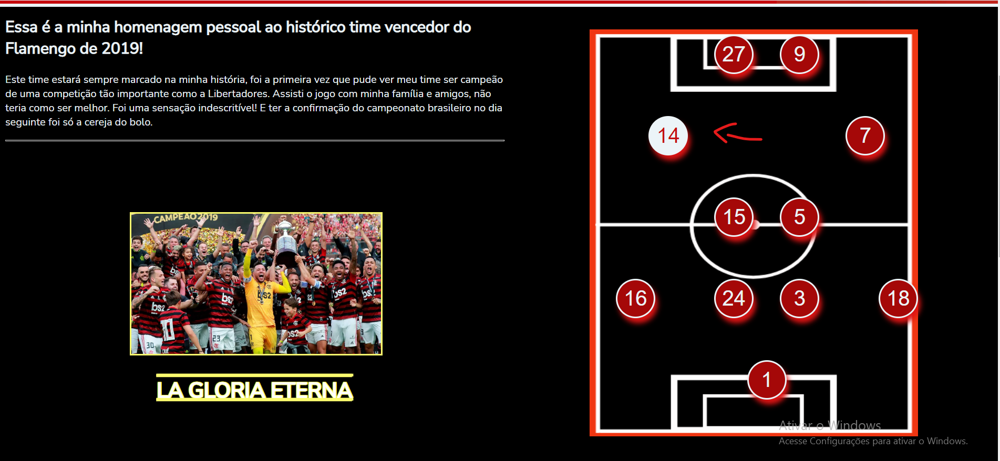
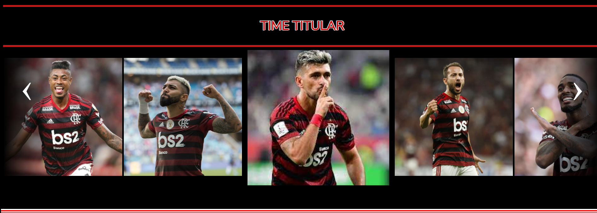
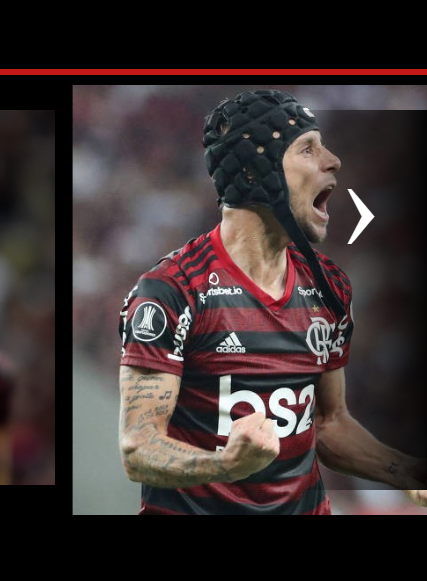

# SITEFLA

Meu primeiro projeto em HTML5 e CSS3.
Decidi fazer uma homenagem ao meu clube de coração Flamengo, mais especificamente ao time de 2019.

Utilizei apenas HTML e CSS nessa primeira versão pois estou caminhando para o 2º período do curso de Sistemas de Informação.
Pretendo fazer alterações futuras, com a implementação de JavaScript e otimização do código original.

# IMAGENS:

## Header:

## Main:
Nesta sessão eu dividi em duas divs: um com um breve texto sobre minha experiência e outra com um campinho contendo a escalação do time.
Ao passar o mouse por cima do número de um jogador, o mesmo muda sua cor a fim de facilitar a visualização.

## Carousel:
Carousel feito apenas com com HTML e CSS.

### Seta(botão) para mudar a sessão do carousel:

